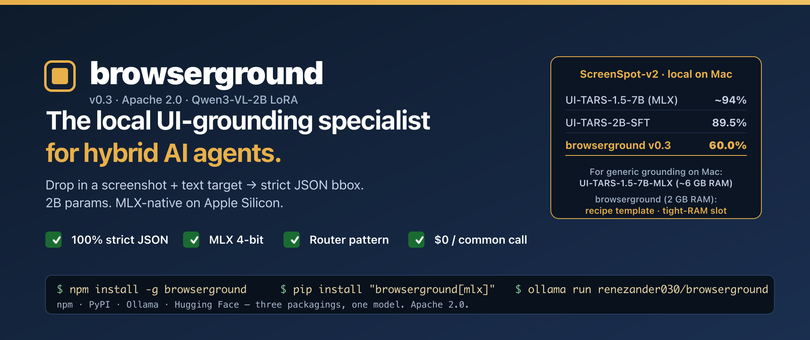

<p align="center">
  
</p>

<h1 align="center">browserground</h1>

<p align="center">
  <strong>The local UI-grounding specialist for hybrid AI agents.</strong><br/>
  Drop in a screenshot + text target, get a strict JSON bbox. 2B params. MLX-native. Apache 2.0.
</p>

<p align="center">
  <a href="https://huggingface.co/renezander030/browserground"></a>
  <a href="https://huggingface.co/renezander030/browserground-mlx"></a>
  <a href="https://huggingface.co/renezander030/browserground-gguf"></a>
  <a href="https://www.npmjs.com/package/browserground"></a>
  <a href="https://pypi.org/project/browserground/"></a>
  <a href="LICENSE"></a>
</p>

---

## TL;DR — when to use browserground (and when to use UI-TARS-MLX instead)

If you're on Apple Silicon with ≥16 GB RAM and you need **generic, max-accuracy UI grounding**, use **[mlx-community/UI-TARS-1.5-7B-4bit](https://huggingface.co/mlx-community/UI-TARS-1.5-7B-4bit)**. It's the obvious default — ~94% on ScreenSpot-v2, MLX-native, drops into `mlx-vlm` directly. ByteDance research-lab compute, you couldn't reproduce it on a budget.

browserground is for two narrower jobs:

### 1. The recipe for *your product's* custom UI grounder

UI-TARS is a finished model. You can use it; you can't easily extend it. The training pipeline is closed, the data mix is proprietary, the base is non-trivial to swap.

browserground is the opposite — it's a **template**. Open base (Qwen3-VL-2B), open training scripts, open data mix. Total recipe cost: **$5 of L40S time + 26k examples + a public LoRA**. Swap in your dashboard's screenshots / your customer app / your internal tooling → ship a domain-trained grounder over a weekend. The 60% generic ScreenSpot-v2 score isn't the deliverable; the *recipe* is. A 60-point baseline on generic screens often becomes 85-95% on your own product's narrow surface because the test distribution finally matches the training distribution.

### 2. The smallest viable slot in a multi-model stack

| Model | Disk @ 4-bit | RAM at inference |
|---|---:|---:|
| UI-TARS-1.5-7B-MLX | ~4 GB | ~5-6 GB |
| **browserground 4-bit MLX** | **~1 GB** | **~2 GB** |

2 GB matters when you're on an 8 GB Mac, or when your agent already runs a 7B planner + an OCR model + an embedding model and you need a small grounder in the same RAM budget. Plus strict JSON output (100% parseable, no regex on prose) — small win, but real.

**A direct head-to-head benchmark of browserground vs UI-TARS-1.5-7B-MLX on the same Apple Silicon hardware is forthcoming.**

### When NOT to pick browserground

- You're on a Mac with ≥16 GB RAM and want max generic accuracy → use UI-TARS-1.5-7B-MLX
- You're not going to fine-tune for your product, and accuracy is the only thing that matters → use UI-TARS-1.5-7B-MLX
- You need a complete agent toolkit, not a piece → look at ByteDance's full UI-TARS stack

### When to pick browserground

- You want to ship a **custom UI grounder trained on your product's screenshots** without spending lab-scale money — use the recipe in this repo as a template
- You're squeezing into a tight RAM budget (8 GB Mac, multi-model hybrid stack)
- You want a CLI / npm / pip / Ollama distribution layer with daemon, HTTP REST, batch, confidence-routed cloud fallback, eval-on-your-data — and you specifically want it on top of an open recipe you can re-run

Full per-split numbers (60% breakdown): mobile-app buttons 78%, text-labelled targets ~74%, icon-only ~41%. On labelled-button-heavy workloads (the common browser case), real-world accuracy is closer to the high end. Icons get fixed in v0.4 with more icon-rich training data.

---

## The hybrid AI argument — for people new to this pattern

Today, most AI agents route **every** screenshot to a cloud frontier model (GPT-4V, Claude Vision, Gemini) — just to figure out *where to click*. That's a $0.01–0.05 multimodal call adding 800ms–2s of round-trip latency, repeated 20–50 times per agent run. The bill compounds. The latency compounds. And screenshots full of private UI leave your machine.

A general-purpose 200B-parameter LLM is overkill for the question "where is the Submit button?" — that's a narrow vision task. The right architecture is a **hybrid one**: cheap fast specialist local models for the dedicated tasks they handle better, and the cloud LLM only for the planning and reasoning it's actually uniquely good at.

That's exactly what **browserground** is — the click-grounding specialist.

<p align="center">
  
</p>

| | Pure-cloud (status quo) | Hybrid (with browserground + confidence routing) |
|---|---|---|
| Per-screenshot cost on the common case | $0.01–0.05 | **$0** (local), cloud only on low-confidence escalations |
| Tokens billed by cloud per step | 1,500+ multimodal | **~40 text** on the local path |
| Screenshots leave machine | yes | **no** for the local path |
| Rate limits | yes | **no** for the local path |
| Per-call latency (local path) | 800ms–2s round-trip | **target ~1.5–3s MLX / ~10–14s transformers**¹ |

¹ MLX numbers are targets for the 4-bit build that just shipped — first independent benchmarks land in v0.4. Transformers numbers are measured on MacBook Air M5 via MPS.

## What ships in v0.3

Three packaged builds, one install for every stack:

| Build | Use it for | Install |
|---|---|---|
| **MLX 4-bit** (1.8 GB) | Apple Silicon, fastest | `npm install -g browserground` (auto) or `pip install "browserground[mlx]"` |
| **GGUF Q4_K_M + f16 mmproj** | Ollama, llama.cpp, cross-platform | `ollama run renezander030/browserground` |
| **PEFT LoRA** (67 MB on Qwen3-VL-2B base) | `transformers`, training, fine-tuning | `pip install "browserground[transformers]"` |

Plus the CLI surface every agent stack actually needs:

- `browserground parse  --target "..."` — single shot, strict JSON
- `browserground parse  --targets queries.txt --jsonl` — batch mode
- `browserground parse  --target "..." --confidence --alternatives 2` — confidence + diverse alternates
- `browserground serve` — Unix-socket daemon (model stays loaded)
- `browserground serve --http :8401` — HTTP REST daemon (`POST /api/ground`)
- `browserground eval <dir> <targets.json> --out report.json` — run accuracy + format-OK + p50/p95 latency on your own labelled data

## Quick start

### npm CLI

```bash
npm install -g browserground
browserground parse screenshot.png --target "Submit button"
# {"bbox_2d": [344, 612, 478, 658]}
```

Daemon mode for fast subsequent calls:

```bash
browserground serve &
browserground parse a.png --target "Chrome icon"
browserground parse b.png --target "the back arrow"
browserground stop
```

HTTP daemon (REST):

```bash
browserground serve --http :8401 &
curl -s -X POST localhost:8401/api/ground \
  -H 'Content-Type: application/json' \
  -d '{"image_path":"/abs/path/screen.png","target":"Submit button"}'
```

Batch + confidence + eval — see [`docs/cli.md`](#what-ships-in-v03) above.

### Python (no Node required)

```bash
pip install "browserground[mlx]"           # Apple Silicon (recommended)
pip install "browserground[transformers]"  # CUDA / CPU / MPS
```

```python
from browserground import ground, click_xy

res = ground("screenshot.png", "the green Subscribe button")
print(res["bbox_2d"], res.get("confidence"))

x, y = click_xy("screenshot.png", "the back arrow")
```

### Ollama

```bash
ollama pull renezander030/browserground
ollama run renezander030/browserground "Locate: Submit button" /path/to/screen.png
```

## Hook into your agent stack

### Claude Code

```bash
mkdir -p .claude/skills/browserground
curl -sL https://raw.githubusercontent.com/renezander030/browserground/main/plugins/claude-code/SKILL.md \
  > .claude/skills/browserground/SKILL.md
```

### Codex CLI

```yaml
# Add to ~/.codex/AGENTS.md
tools:
  - name: browserground
    command: browserground parse "$IMAGE_PATH" --target "$TARGET"
    description: Locate a UI element on a screenshot. Returns {"bbox_2d":[x1,y1,x2,y2]}.
```

### browser-use

```python
from browser_use import Agent, Controller
from browserground_adapter import register

controller = Controller()
register(controller)   # adds `click_target("the Submit button")` action
```

Drop-in adapter: [`plugins/browser-use/browserground_adapter.py`](./plugins/browser-use/browserground_adapter.py).

### Skyvern (with confidence-routed cloud fallback)

```python
from browserground_skyvern import ground_with_fallback

bbox = ground_with_fallback(
    screenshot_path, target,
    confidence_threshold=0.55,
    cloud_fallback=your_cloud_grounding_fn,
)
```

Adapter + integration notes: [`plugins/skyvern/`](./plugins/skyvern/).

## How it works

- Base: [`Qwen/Qwen3-VL-2B-Instruct`](https://huggingface.co/Qwen/Qwen3-VL-2B-Instruct)
- Method: LoRA rank 32 (34.9 M trainable params, 1.6% of base) on all linear modules of the LM
- Training mix (26k records): 6k OS-Atlas macOS desktop + 6k Android (aw_mobile) + 6k UIBert mobile + 8k wave-ui browser
- Schedule: 1 epoch, bf16, LR 1e-4 cosine, batch 1 × grad-accum 8, ~4.5 hr on a single RTX A6000
- Output: strict JSON `{"bbox_2d": [x1, y1, x2, y2]}` — system prompt + LoRA produce 100% parseable output
- Packaging: MLX 4-bit (Apple Silicon), GGUF Q4_K_M + f16 mmproj (Ollama / llama.cpp), PEFT adapter (transformers)

Training scripts and eval JSONs: [renezander030/imgparse-tier1](https://github.com/renezander030/imgparse-tier1) (private — request access).

## What would it take to reach UI-TARS-level accuracy (~89-90%)?

The gap is **compute + data**, not architecture. Concrete recipe to close it:

| Lever | v0.3 (this) | v0.5+ target |
|---|---|---|
| Training records | 26k | 250k–500k (10–20× more) |
| Epochs | 1 | 3–5 |
| Adapter size | LoRA rank 32 (1.6% of base) | rank 128 or full fine-tune |
| Icon-rich data | thin | balanced — closes the 41% icon split |
| Training stages | SFT only | SFT → DPO with preference data |
| Compute spend | $2.20 | ~$200–500 |

This is reproducible — the training scripts in `imgparse-tier1` are the template. The current v0.3 is the *recipe-validated* milestone at the cheap end of the spectrum; the same code scales linearly to the higher-budget tier.

## Limitations

- Icon UI accuracy (~41%) lags text UI (~74%) — icons under-represented in the 26k training mix (fixed in v0.4)
- English-only training data
- No mouse-action prediction (only location — pair with an action predictor for full computer-use loops)
- MLX latency numbers are targets, not yet independently benchmarked at v0.3 release

## License

Apache 2.0.

---

```bibtex
@misc{browserground-2026,
  title  = {browserground: Qwen3-VL-2B LoRA for hybrid AI agent UI grounding},
  author = {Zander, René},
  year   = {2026},
  url    = {https://huggingface.co/renezander030/browserground}
}
```
