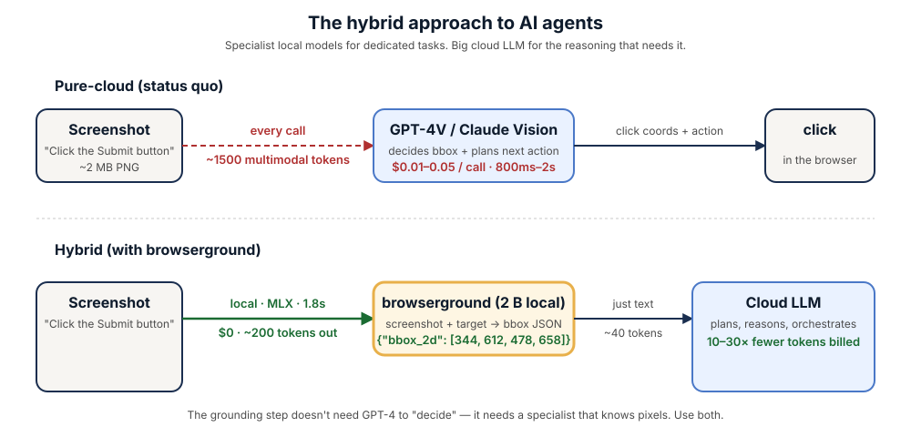

<p align="center">
  
</p>

<h1 align="center">browserground</h1>

<p align="center">
  <strong>The local UI-grounding specialist for hybrid AI agents.</strong><br/>
  Drop in a screenshot + text target, get a strict JSON bbox. 2B params. MLX-native. Apache 2.0.
</p>

<p align="center">
  <a href="https://huggingface.co/renezander030/browserground"></a>
  <a href="https://www.npmjs.com/package/browserground"></a>
  <a href="LICENSE"></a>
  
</p>

---

## The hybrid AI argument

Today, most AI agents route **every** screenshot to a cloud frontier model (GPT-4V, Claude Vision, Gemini) — just to figure out *where to click*. That's a $0.01–0.05 multimodal call adding 800ms–2s of round-trip latency, repeated 20–50 times per agent run. The bill compounds. The latency compounds. And screenshots full of private UI leave your machine.

A general-purpose 200B-parameter LLM is overkill for the question "where is the Submit button?" — that's a narrow vision task. The right architecture is a **hybrid one**: cheap fast specialist local models for the dedicated tasks they handle better, and the cloud LLM only for the planning and reasoning it's actually uniquely good at.

That's exactly what **browserground** is — the click-grounding specialist.

<p align="center">
  
</p>

| | Pure-cloud (status quo) | Hybrid (with browserground) |
|---|---|---|
| Per-screenshot cost | $0.01–0.05 | **$0** |
| Latency | 800ms–2s round-trip | **~1.8s local, no network** |
| Tokens billed by cloud | 1,500+ multimodal | **~40 text tokens** |
| Screenshots leave machine | yes | **no** |
| Rate limits | yes | **no** |

## Status: v0.1 (Tier 1.5 LoRA)

ScreenSpot-v2 point-grounding accuracy (300 items, 100/split):

| Model | Params | Overall | Mobile | Desktop | Web | Format-OK |
|---|---:|---:|---:|---:|---:|---:|
| GPT-4o (cloud) | — | 18.3% | — | — | — | — |
| **browserground v0.1** | **2 B** | **45.3%** | **64.0%** | 28.0% | 44.0% | **100%** |
| SeeClick | 9.6 B | 55.1% | — | — | — | — |
| ShowUI-2B | 2 B | 75.5% | — | — | — | — |
| UI-TARS-2B-SFT | 2 B | 89.5% | — | — | — | — |
| OS-Atlas-Base-7B | 7 B | ~91% | — | — | — | — |
| zero-shot Qwen3-VL-2B | 2 B | 6.3% | 7.0% | 6.0% | 6.0% | 100% |

- Beats **GPT-4o by 2.5×** and zero-shot Qwen3-VL by **7×** on the same benchmark
- **100% strict-JSON format compliance** — no fences, no commentary
- v0.2 (target ≥ 60%) on the roadmap

## Quick start

```bash
npm install -g browserground
browserground parse screenshot.png --target "Submit button"
# {"bbox_2d": [344, 612, 478, 658]}
```

Daemon mode for fast subsequent calls:

```bash
browserground serve &
browserground parse a.png --target "Chrome icon"
browserground parse b.png --target "the back arrow"
browserground stop
```

## Hook into your agent stack

### Claude Code

```bash
mkdir -p .claude/skills/browserground
curl -sL https://raw.githubusercontent.com/renezander030/browserground/main/plugins/claude-code/SKILL.md \
  > .claude/skills/browserground/SKILL.md
```

Claude routes screen-grounding prompts to the CLI. Spec at [`plugins/claude-code/SKILL.md`](./plugins/claude-code/SKILL.md).

### Codex CLI

```yaml
# Add to ~/.codex/AGENTS.md
tools:
  - name: browserground
    command: browserground parse "$IMAGE_PATH" --target "$TARGET"
    description: Locate a UI element on a screenshot. Returns {"bbox_2d":[x1,y1,x2,y2]}.
```

### browser-use / Skyvern (Python)

```python
import subprocess, json
def ground(screenshot_path, target):
    out = subprocess.check_output(["browserground", "parse", screenshot_path, "--target", target])
    return json.loads(out)["bbox_2d"]
```

## How it works

- Base: [`Qwen/Qwen3-VL-2B-Instruct`](https://huggingface.co/Qwen/Qwen3-VL-2B-Instruct)
- Method: LoRA rank 16 (17.4 M trainable params, 0.81% of base) on all linear modules of the LM
- Training mix (12k records): 4k OS-Atlas macOS desktop + 4k Android + 4k UIBert mobile
- Output: strict JSON `{"bbox_2d": [x1, y1, x2, y2]}` — system prompt + LoRA produce 100% parseable output

Training scripts and eval JSONs: [renezander030/imgparse-tier1](https://github.com/renezander030/imgparse-tier1) (private — request access).

## What's planned

- **v0.2** — Tier 2 LoRA: 26k mixed incl. web, rank 32, 2 epochs, target ScreenSpot-v2 ≥ 60%
- **MLX-native build** — ~1-2s on Apple Silicon (currently ~14s via MPS+transformers)
- **GGUF build** — for llama.cpp / Ollama
- **Batch mode** — many targets per screenshot in one call

More in v0.2.

## Why this exists

Pure-cloud AI agents are bottlenecked on vision-LLM cost and latency. Open-source 2B–7B specialist models can match cloud LLMs on narrow tasks (UI-TARS-2B hits 89.5% on ScreenSpot-v2 vs GPT-4o's 18.3%). The **composition pattern** — specialist local models for narrow tasks + cloud LLMs for general reasoning — is the cost-effective architecture for 2026 AI agents. browserground is one specialist piece. Bring your own orchestrator.

## Work with me

This adapter is a public reference of the recipe I deliver to freelance clients: small, fast, structured-output local specialists that slot into compound-AI agent stacks and cut cloud-LLM bills without losing capability.

If you need one of these, I can build it:

- a **UI-grounding model trained on your own product's screenshots** — your dashboard, your app, your customer interfaces — for higher recall on the elements your agents actually click
- a **hybrid agent architecture** routing narrow tasks (grounding, OCR, classification, embedding, extraction) to local specialists, reserving cloud frontier LLMs for the reasoning that actually needs them
- an **on-prem agent deployment** — Apple Silicon (MLX), CUDA box, or your existing K8s — with no screenshots leaving your infrastructure
- a **structured-output evaluation harness** that tells you when the local model is actually good enough to replace the cloud call in production

Reach out: <https://renezander.com>

## License

Apache 2.0.

## Author

[René Zander](https://github.com/renezander030). Issues + PRs welcome.

---

```bibtex
@misc{browserground-2026,
  title  = {browserground: Qwen3-VL-2B LoRA for hybrid AI agent UI grounding},
  author = {Zander, René},
  year   = {2026},
  url    = {https://huggingface.co/renezander030/browserground}
}
```
